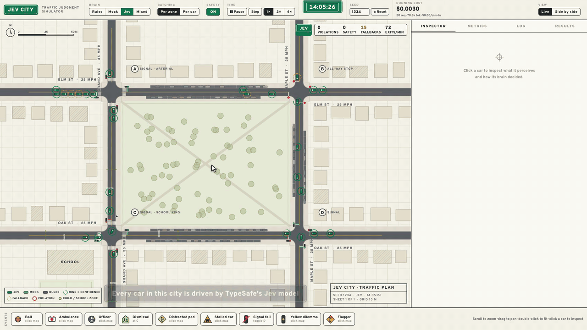
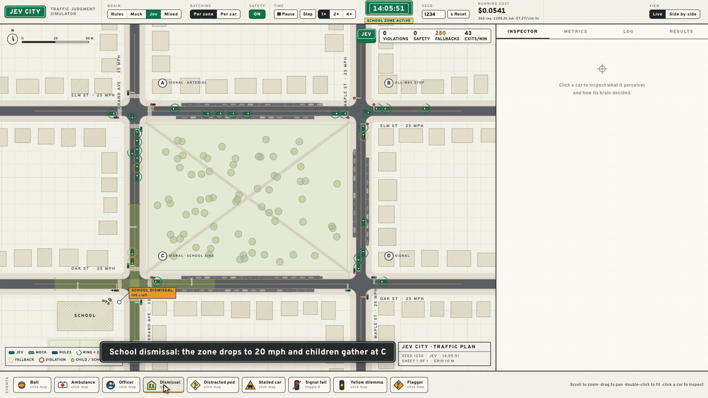
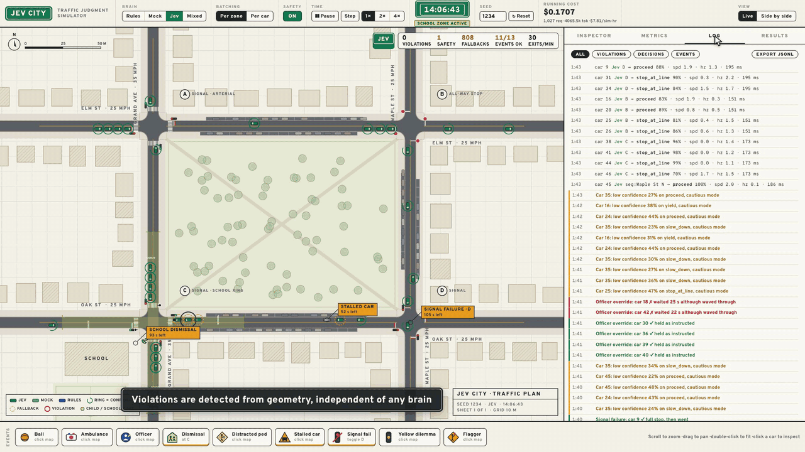

# Jev City

A small traffic simulation where every car is driven by TypeSafe's Jev model. A hand-written rule-based driver can run the same city, so every number has a baseline.



[Watch the full demo (1 min 49 s, 1080p)](docs/media/jev-city-demo.mp4)

## Why I built this

I wanted to answer two questions with numbers.

1. How good is a fast decision model at real driving judgment, the calls a rulebook doesn't cover?
2. What happens to traffic when every car in a city makes those calls at the same time?

So I built a city with four intersections and 30 cars and let Jev drive. Then I ran the same city with a rule-based driver and compared the two.

## How it works

- Code describes each car's situation in a few lines of plain text. Distances, timing and "can it stop in time" are worked out in code. Jev never sees pixels and never does math.
- Jev answers five typed questions per car: what to do, how fast, how dangerous it is, whether the law says stop, and whether it has the right of way.
- Code does the actual driving: following, braking, turning, and a safety reflex. Jev only makes the tactical call.
- Cars at the same intersection share one request, about three times a second. The whole city is capped at 15 requests per second.
- The rule-based driver reads the same facts but not the text. It's what a careful engineer would write in an afternoon.
- Violations (red lights, rolled stops, pedestrians, ambulances, collisions) are detected from geometry, whichever brain is driving.

## Judgment events

There are nine things you can drop into the city with a click: a ball rolling out from between parked cars, an ambulance, a police officer overriding the lights, school dismissal, a pedestrian on their phone at the curb, a stalled car, a signal failure, a yellow light at a bad moment, and a construction flagger.



## Rules vs Jev, side by side

Same seed, same moment, same event. The rule-based driver runs the left city and Jev runs the right one.



## Results

**Benchmark.** 100 frozen scenarios, run 3 times each: 40 clear-cut, 40 judgment calls and 20 ambiguous ones where more than one answer is fine. An answer counts as right when it's in the scenario's list of acceptable actions.

| | Overall | Clear-cut | Judgment | Ambiguous | Latency (p50) | Same answer all 3 runs |
|---|---|---|---|---|---|---|
| Rule-based | 90.0% | 100% | 75.0% | 100% | under 1 ms | 100% |
| Jev | 88.3% | 88.3% | 85.0% | 95.0% | 199 ms | 95% |

**Live city.** Same seed, 30 cars, 2 minutes of real time.

| | Cars through intersections per minute | Average trip | Violations | Safety interventions |
|---|---|---|---|---|
| Rule-based | 56.0 | 57 s | 0 | 0 |
| Jev | 42.5 | 72 s | 0 | 0 |

What stood out:

- **Jev handles what only exists in words.** When a ball has already rolled away, a pedestrian is staring at a phone, or kids wait at the curb, the rule-based driver sees an empty lane and keeps going. Jev slows down.
- **It's weaker when the answer takes an extra step of logic.** At a four-way stop it sometimes goes when it arrived second. When an officer waves it through a red light, it often stops anyway.
- **Its confidence means something.** When Jev was at least 90% sure, it was right every time in the benchmark. Below 50%, it was right 71% of the time.
- **Caution costs traffic flow.** About 1 in 10 live decisions comes back under 50% confidence, mostly "go or slow down?" while creeping in a queue. Those cars switch to a cautious mode, and the city moves about 24% fewer cars per minute than with the rule-based driver.
- **Batching is fine.** Five cars in one request scored the same as one car per request (87.7% vs 85.3%) and used 24% fewer tokens per car.
- **It's cheap.** A live request averages about 3,500 tokens. With every car on Jev, that's roughly $7 to $8 per simulated hour. The full benchmark (300 calls) cost about one cent.

A caveat: I wrote the scenario labels and the rule-based driver, so the clear-cut scores lean its way. The labels are a first draft in `bench/scenarios.json`, marked for review.

## Run it

You need Node 20+ and pnpm.

```sh
pnpm install
cp .env.example .env   # add TYPESAFE_API_KEY to drive with Jev
pnpm dev
```

Then open http://localhost:5173. Without a key, pick Mock (a noisy copy of the rule-based driver) and everything else still works. Add `?brain=jev` to start with Jev driving, or `?view=sbs` to open side by side.

| Command | What it does |
|---|---|
| `pnpm bench` | Runs the 100 scenarios and writes `bench/results.md` |
| `pnpm sim:check` | Runs the city headless and fails on any violation |
| `pnpm smoke` | Makes one Jev call to check your key |
| `pnpm record:demo` | Records the demo video (needs `pnpm dev` and ffmpeg) |

## More

- [How it works](docs/how-it-works.md): the three layers, what Jev is asked, the events, and the choices I made along the way
- [Benchmark](bench/README.md): how the scenarios and scores work
- [Full benchmark results](bench/results.md)

Built with TypeScript, Canvas 2D, Vite, Hono and the TypeSafe SDK. Jev is pinned to `jev-1.13.0`.
