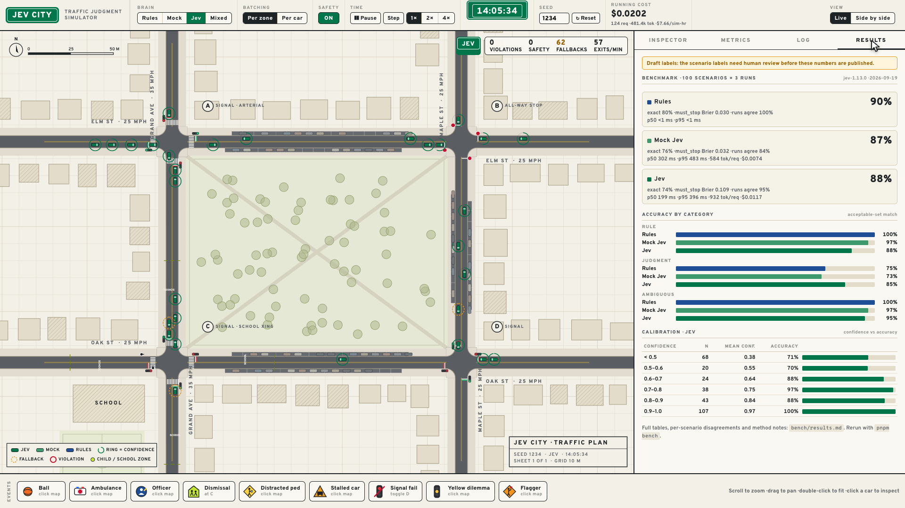

# Benchmark

The benchmark runs 100 frozen driving situations through each driver and scores the answers. There's no simulation involved, just a situation, the questions and a label.

## The scenarios

`scenarios.json` holds 100 snapshots:

- **40 clear-cut**: the law and the facts settle it (red lights, stop signs, clear greens).
- **40 judgment calls**: a ball in the road, a distracted pedestrian, an ambulance, an officer, a stalled car and similar.
- **20 ambiguous**: more than one answer is reasonable, so the list of acceptable answers is wider.

Each scenario has the text Jev would see, the structured facts the rule-based driver reads, one expected action, a list of acceptable actions, and a must-stop label. The text is generated by the same code the live city uses, so the benchmark tests exactly what Jev sees while driving.

The must-stop label reads the question literally: "does traffic law require this car to stop before the next stop line?" A stop sign counts even after the car has stopped there. A child running into the road is an emergency stop, but there's no stop line involved, so it's labelled no.

**The labels are a first draft.** I wrote them alongside the rule-based driver, so review them before trusting or sharing any numbers. To change a scenario, edit `src/build-scenarios.ts` and run:

```sh
pnpm --filter @jev-city/bench scenarios
```

## Running it

```sh
pnpm bench                                  # Rules, Mock and Jev (Jev needs a key)
pnpm bench -- --brains rules,jev --runs 3   # pick drivers and repeats
pnpm bench -- --limit 20                    # first 20 scenarios only
pnpm bench -- --pack 5                      # batching test: 5 scenarios per Jev request
pnpm bench -- --rerender                    # rebuild results.md from results.json
```

Each scenario is one request carrying all its questions, run 3 times per driver. Output goes to `results.json` (every answer) and `results.md` (the tables).

## What gets measured

- **Accuracy:** the chosen action is on the acceptable list. Exact match is also reported.
- **Must-stop Brier score:** how far the must-stop probability is from the label. 0 is perfect and 0.25 is a coin flip.
- **Calibration:** answers grouped by confidence, next to how often each group was right.
- **Latency:** p50 and p95.
- **Tokens and cost:** from the API's own counts.
- **Consistency:** how often all 3 runs gave the same answer.

## Latest run

The app's Results tab shows the same numbers.



| | Overall | Clear-cut | Judgment | Ambiguous | Brier | Latency (p50) |
|---|---|---|---|---|---|---|
| Rule-based | 90.0% | 100% | 75.0% | 100% | 0.030 | under 1 ms |
| Mock | 87.3% | 96.7% | 73.3% | 96.7% | 0.032 | 302 ms (simulated) |
| Jev | 88.3% | 88.3% | 85.0% | 95.0% | 0.109 | 199 ms |

The rule-based driver's Brier score is low partly by construction: its must-stop logic uses the same rules I used to write the labels. Mock is the rule-based driver with noise added, and it's only there to test the plumbing without a key.

With `--pack 5`, Jev scored 87.7% against 85.3% with one car per request, and used 24% fewer tokens per car. Sharing a request doesn't hurt the individual answers.
